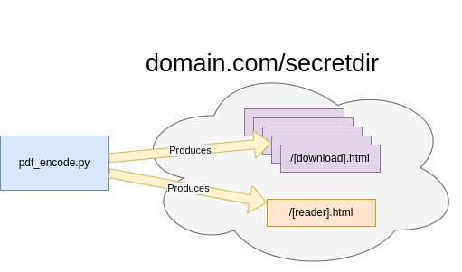
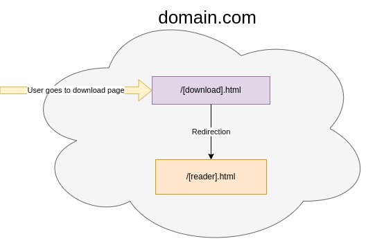

# The Files for Freedom Toolkit

Support free access to information using nothing more than your existing web server and a one-liner.

To learn about the mission behind the Files for Freedom movement, the technical details, and to see a live demo, visit [files-for-freedom.web.app](https://files-for-freedom.web.app/)

## Usage
```python3 pdf_encoder.py [pdf to encode] [downloader page name]```

## How it works
### Host:

* The host runs `pdf_encoder.py` for each target pdf. The tool generates a _/[downloader page].html_ and a single _/[reader].html_
* All the host has to do after that is put the newly generated HTML files into their web server and share the URL for their downloader page.

### User:

* User visits _/[downlaoder page].html_  and on that page the pdf will be saved in their indexDB cache
* Then it will redirect the user to the _/[reader].html_ page where all the saved PDF's can be easy read and managed.

----
### Output Description
**downloader .html file:**
 * This file will be what the user visits in order to download the [pdf to encode]
 * Will also have name given [downloader name]

**reader .html file:**
 * This file is what the download pages redirect to, it is a simple page to view and easily read all saved documents.
 * This is also the page that will be cached, so the user can come back to this page offline for reading at anytime.

**.readerName:**
 * Keeps track of the randomly generated name of the reader page.